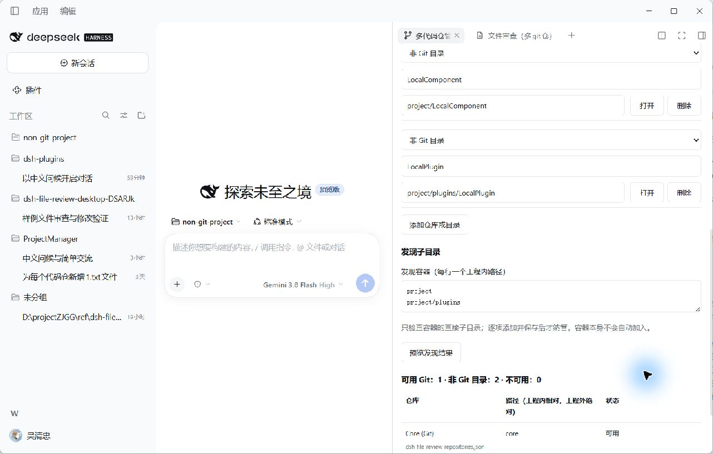

# 多代码仓管理使用手册

[简体中文](USER_GUIDE.md) | [English](USER_GUIDE.en.md)

适用于管理插件 **0.1.4**。本手册按照当前源码和 Windows Desktop 0.2.0-rc.2 的实际界面编写。安装方式见 [README](../README.md#安装)，文件审查由配套消费者提供。

## 1. 安装与打开

安装管理插件后，在 Desktop「插件」页启用它。需要文件审查时，再安装并启用精确依赖管理插件 0.1.4 的审查插件 0.3.5。当前 Profile 必须选中需要加载的插件。

进入目标工程的会话，打开右侧栏，在「开始」页选择 **多代码仓管理**。如果已经有其他 Tab，点击右侧 **+** 新建标签页，再从开始页选择管理入口。管理页使用原生 Tab，可以分栏和全屏；会话顶部不再提供管理页签。

当前工程目录、项目名称和项目文件名由会话确定，只读显示。切换隐藏的 Tab 会保留未保存表单；生成、保存或重新加载前，请核对正在管理的工程。



图中为隔离测试工程：1 个 Git 仓库、2 个普通目录，保存后正常退出并重启 Desktop。截图使用中文宿主，验证范围见 [第 9 节](#9-验证范围)。

## 2. 添加 Git 仓库或普通目录

1. 点击 **添加仓库或目录**。
2. 类型选择 **Git** 或 **非 Git 目录**，填写便于识别的名称。
3. 填写路径，或点击该行 **打开** 选择已有目录。内部目标使用工程相对路径，外部目标显示绝对路径。
4. 勾选 **启用多代码仓管理**。如果需要根目录内的文件，再勾选 **同时包含项目根目录内的文件**。
5. 首次点击 **生成新配置文件**；已有配置时点击 **保存配置**，再查看下方的数量、来源和状态。

“Git”表示这个目录自身是 Git 根目录，包括有效的 worktree。普通组件即使位于一个父 Git 仓内，只要没有自己的 Git 元数据，也可以选择“非 Git 目录”。父仓的 ignore 规则不会改变组件自身类型。

根目录选项按工程根的自身元数据自动分类。因此，没有自身 Git 的 `dsh-plugins` 根目录会显示为普通目录，其下两个独立 Git 仓仍分别显示。取消根目录选项后，仅列出的目标参与多目标范围。

## 3. 发现子目录

在 **发现容器（每行一个工程内路径）** 中填写，例如：

```text
project
project/plugins
```

点击 **预览发现结果**。插件只检查这些容器的直接子目录，不读取源码或执行项目命令。已纳管路径和嵌套容器自身不会重复作为候选。不存在或不可用的容器会给出说明。

对需要管理的可用候选逐项点击 **添加到列表**，然后保存。发现结果不是已启用范围；容器本身也不会自动成为目标。如果需要管理容器内散落的文件，应显式添加该容器。

## 4. 保存与重载

配置文件固定为工程内的 `dsh-file-review-repositories.json`。管理服务统一维护此文件；消费者只读取管理结果。

| 配置项 | 含义 |
| --- | --- |
| `version` | 文件格式固定为 2 |
| `enabled` | 是否启用该工程的多目标范围 |
| `includeProjectRoot` | 是否把工程根目录作为管理目标 |
| `repositories` | Git 目标的名称和工程内相对路径 |
| `directories` | v2 普通目录的名称和工程内相对路径 |
| `discovery.containers` | v2 发现容器路径；候选仍需单独添加 |

只读取和保存 v2，不导入历史清单或转换格式。完整 JSON 示例见 [README](../README.md#配置示例)。

工程根路径从文件位置推导。配置最多 1 MiB、512 个目标和 32 个发现容器。重复路径规范化后合并；同一路径不能同时声明为两种显式类型。

手工编辑 JSON 后点击 **重新加载已保存配置**，它会替换当前未保存表单。文件在打开表单后被其他程序修改时，保存会拒绝旧修订；保留需要的草稿，重新加载，再合并修改。未知字段、未来格式版本和不合法路径也不会被静默覆盖。

只有生成并启用项目文件后才启用额外多目标范围，Profile 只记录工程根目录。未配置或关闭多目标管理时使用当前会话的基础范围。

## 5. 工程外临时目标

先生成工程配置，再添加工程外绝对路径并选择类型。父目录、兄弟目录、跨盘路径和指向工程外的目录联接都属于外部路径，不能随项目文件持久化。

临时条目只在添加它的会话中使用，不写入 JSON，也不改变其他会话。Agent 释放、插件卸载或进程重启后需要重新添加；关闭一个 Tab 不等于释放整个会话。

临时条目变更可通知消费者重新获取范围；内部配置的未保存编辑仍要保存后才成为有效范围。插件不会执行 clone、pull 或 Git 初始化，也不会为普通目录创建差异基线。

## 6. 类型、状态与移除

| 状态 | 含义与处理 |
| --- | --- |
| 可用 `ready` | 目标类型与实际目录一致，可供对应消费者使用 |
| 路径缺失 `missing` | 目标不存在；检查路径或移除配置 |
| 不是 Git `notGit` | 声明为 Git，但该目录没有自身有效 Git 元数据 |
| 类型已变化，请确认转换 `kindMismatch` | 声明为普通目录，但出现了自身 Git 元数据；显式改为 Git 并保存 |
| 错误 `error` | Git 元数据损坏或目录无法读取；按原因修复后重载 |

调整类型只改变管理声明，不运行 `git init`，也不改写消费者保存的历史引用。点击行内 **删除** 会出现确认框；确认后移除表单条目，再保存内部配置。磁盘目录及文件保留。

更深的目标优先，即使该目标不可用，也不会把它的文件交给父根。未纳管的容器子目录、未知嵌套 Git、`.git` 元数据和越界链接不能由父目录兜底授权。开发者应查看 [目标与文件归属](ARCHITECTURE.md#目标与文件归属)，普通用户可在对应目标修复状态后重载。

## 7. 与文件审查配合

管理配置保存后，消费者通过共享通知重新获取工作区。手工修改 JSON 不产生管理通知，因此需要重载。管理 Tab 与文件审查 Tab 分别注册，管理插件可以独立使用。

审查插件的 **全部 Git 仓库**、**全部非 Git 目录** 是汇总项，`名称（非 Git 目录）` 是具体目标。它们是不同筛选范围，不是重复配置。

普通目录在审查消费者中仅支持宿主已记录的上一轮、本会话和待确认改动，Git 五种比较模式禁用。没有宿主改动记录的手工编辑不会凭空产生差异。评论、按文件确认、复制和有证据的撤销由审查插件提供，管理插件只提供目标与归属。

## 8. 常见问题

| 问题 | 处理 |
| --- | --- |
| 找不到管理入口 | 确认插件已启用、当前会话有工程目录，从右侧开始页打开 |
| 安装后仍显示旧文案 | 完整退出重启；同版本包使用新摘要文件名安装，并核对已安装 Client 哈希 |
| 「打开」没有从填写路径开始 | 检查原生目录选择的起始路径支持；0.2.0-rc.2 兼容脚本及备份方式见 README |
| 预览有条目但审查没有额外目标 | 生成、保存并启用工程配置；发现候选和 Profile 索引不会自动扩大范围 |
| 改变类型后目标不可用 | 核对真实 Git 元数据与所选类型，修复路径后保存和重载 |
| 外部目标重启后消失 | 会话临时目标按设计不持久化，重新显式添加 |
| 切换工程后看到不同配置 | 每个会话按其工程和最近的项目文件解析，不使用另一会话的临时数据 |

## 9. 验证范围

本轮回归覆盖 v2 配置、完整契约、临时目标隔离、文件归属、双包联装与浏览器交互；当前实机结果见 [版本记录](releases/version.md#v014)。完整 Web、正式版和其他平台未完成实际验收。
